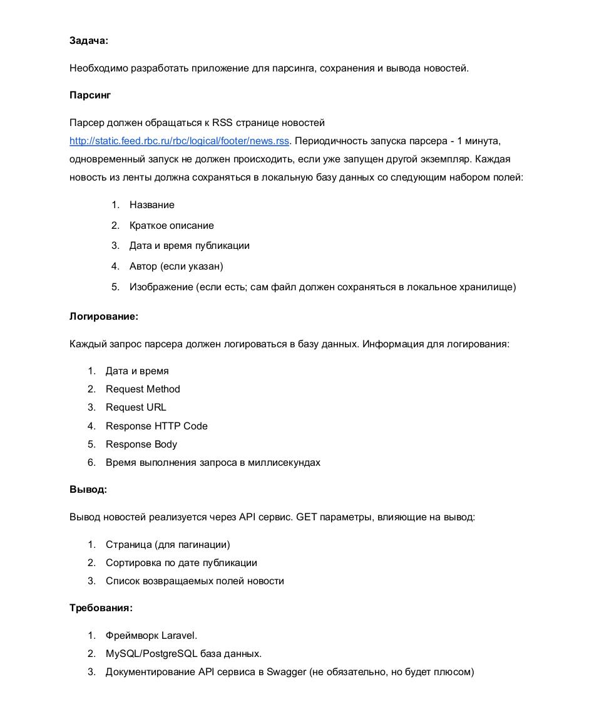

Можно парсить с разных источников. Процесс будет повторятся после запуска через /api/start-parsing. Каждый перезапуск Джоба вычещает предыдущие данные конкретного ресурса новостей

<h1 style="text-align: center;color: #6610f2">разворачивание</h1>  
<pre>
cd docker/

bash ./run.sh  - разворачивает все ( если нужен прод конфиг, то его нужно создать .env.prod и вызвать скрипт с параметром: bash ./run.sh prod)
bash ./stop.sh  - удаляет все контейнеры, данные остаются
bash ./drop_data.sh  - удаляет базу данных физически с дискаБ, но делает бэкап папки и сохраняет в той папке где была база
</pre> 

<h3 style="text-align: center;color: #6610f2">
Логи пишутся в папку ./docker/logs
</h3>
